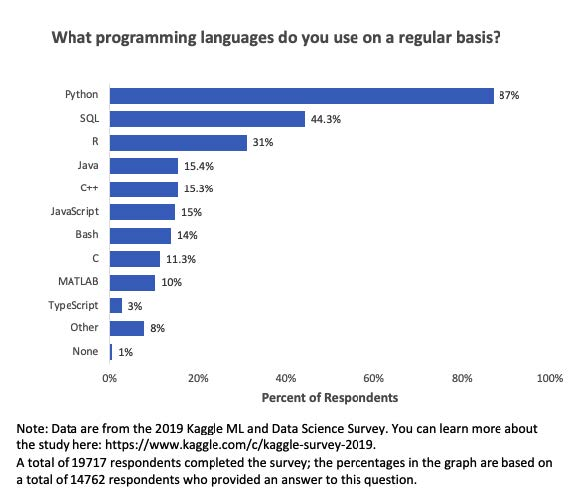

FIXME

## **R**
R is a programming language used to perform statistical computations and implement graphics. 
It is open-source and free and generally used by statisticians for data mining, data analytics. 

It helps to perform data wrangling, analyzing and visualizing data easily.

R has a list of packages each of which helps you perform certain function. 

As of January 2017, there are more than 10,000 packages for R, the list of which you can find here.

Each package can easily be downloaded and used in R.

In a 2019 survey conducted by Kaggle, R was the third most used programming language by data professionals.

 

## **RStudio**

RStudio is the integrated development environment (IDE) for R. It is available in two versions:
* RStudio Desktop - Regular desktop application
* RStudio Server - Runs on a remote server and accessed RStudio using a web browser

*Script Area – Write codes (or) scripts and run them separately

*Console – Write and run the code together directly here

*Environment – List of objects and variables created and present in the current session

*Graphics – Displays the plots

You can find the list of keyboard shortcuts for RStudio [FIXME LINK]

