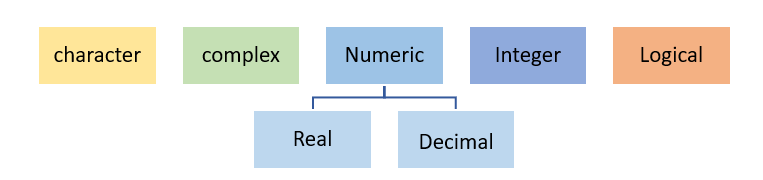

FIXME

## Variables

-It’s a memory location where you store some type of value and where that value can be altered based on your need.
Variable is also known as **Identifier** because the variable name identifies the value that is stored in the memory (RAM). 
As we Know R is a case-sensitive language hence a variable ABC = 15 and Abc= 32 can have different values.

### Naming Variables
-	Variable name must start with “letter” and can contain a number, letter, underscore (_) and period (‘.’) e.g.- variableName1, one. variable 

-	Underscores (_) at the beginning of the variable name is not allowed. E.g.- _variable_one.

-	Periods (.) at the beginning of the variable name are allowed but should not be followed by a number eg - .1myvariable
 
-	Reserved words or keywords are not allowed to be identified as a variable name.

-	Special characters such as “#”, “&’, etc., along with white spaces (tabs, space) are not allowed in a variable name

#### Variable Type in R 
To know the type of the variable in R, we can use the following two functions
-**mode ()** – is a mutually exclusive classification of objects according to their basic structure and is the basic building block for data objects in R. There are 6 basic atomic codes in R – logical, integer, real, complex, string (or character) and raw

-**Type ()**- This returns the low-level value which matches the internal type of object in R. 

Removing a variable, the following command can be used rm ()

## **Data Types**

-	Data type in R specifies the size and type of information the variable will store.
-
-	R language has five main data types

### Character data type 

-	Character data type stores value or strings and contains alphabets, numbers, and symbols

-	Character data type value is written withing single (‘ ‘)or double inverted quotes (“ “) 
Example- “A”, “2.21”, “skill@”.

~~~
# input code
# Declaring character value with double quotes ""
charac <- "Abcd"
charac
class(charac)
# Declaring character value with single quotes ''
charac_1 <- 'b'
charac_1
class(charac_1)
~~~
{: .language-r}

~~~
# output
# Declaring character value with double quotes ""
> charac <- "Abcd"
> charac
[1] "Abcd"
> class(charac)
[1] "character"
 # Declaring character value with single quotes ''
> charac_1 <- 'b'
> charac_1
[1] "b"
> class(charac_1)
[1] "character"

~~~
{: .output}



