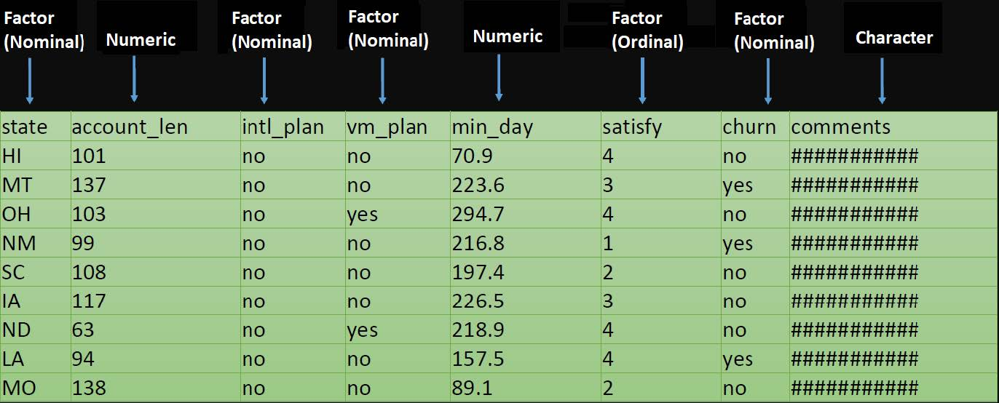
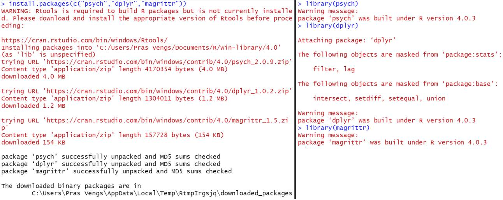

FIXME

## Variables

-It’s a memory location where you store some type of value and where that value can be altered based on your need.
Variable is also known as **Identifier** because the variable name identifies the value that is stored in the memory (RAM). 
As we Know R is a case-sensitive language hence a variable ABC = 15 and Abc= 32 can have different values.

### Naming Variables
-	Variable name must start with “letter” and can contain a number, letter, underscore (_) and period (‘.’) e.g.- variableName1, one. variable 

-	Underscores (_) at the beginning of the variable name is not allowed. E.g.- _variable_one.

-	Periods (.) at the beginning of the variable name are allowed but should not be followed by a number eg - .1myvariable
 
-	Reserved words or keywords are not allowed to be identified as a variable name.

-	Special characters such as “#”, “&’, etc., along with white spaces (tabs, space) are not allowed in a variable name

#### Variable Type in R 
To know the type of the variable in R, we can use the following two functions
-**mode ()** – is a mutually exclusive classification of objects according to their basic structure and is the basic building block for data objects in R. There are 6 basic atomic codes in R – logical, integer, real, complex, string (or character) and raw

-**Type ()**- This returns the low-level value which matches the internal type of object in R. 

Removing a variable, the following command can be used rm ()

## **Data Types**

**1 )character** – Letter, words or strings which vary mostly and do not have any particular meaning for the data, e.g. Comments, Usernames

**2) Numeric** – Numbers which are continuous, e.g. Age, Temperature, Location coordinates

**3) Factors** – Can be numeric/character but have only a fixed set of values, e.g. Age groups, Race

  a) Nominal – The order of the factors does not matter since they have no significance, e.g. Country, Gender, Race

  b) Ordinal – These factors can be ordered since they hold a numerical significance, 
e.g. Satisfaction rating (“extreme dislike”, “dislike”, “neutral”, “like”, “extreme like”)



