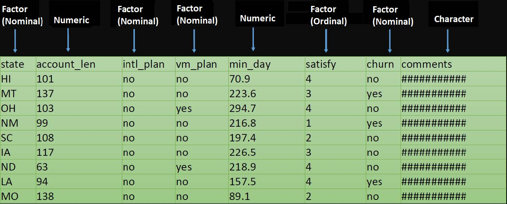
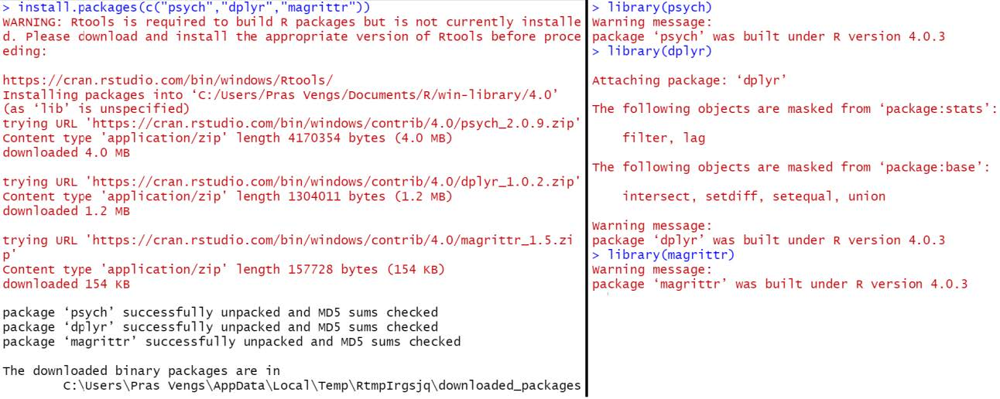

FIXME

## **Packages**

Package - collection of R functions, data and compiled code

Library - The location where the packages are stored

If there is a particular functionality that you require, you can download the package from the appropriate site,
and it will be stored in your library. To use the package, use the command **library()**
to load the package in the current R session. Then just call the appropriate package functions install.packages("package_name") 

– Install the package from **CRAN repository install.packages**( c("package_1", “"package_2", "package_3") )

 – Install multiple packages library("package_name") 
 
– Load the package in current R session

~~~
install.packages("pacman")

~~~
{: .language-r}

## **Data Types**

**1 )character** – Letter, words or strings which vary mostly and do not have any particular meaning for the data, e.g. Comments, Usernames

**2) Numeric** – Numbers which are continuous, e.g. Age, Temperature, Location coordinates

**3) Factors** – Can be numeric/character but have only a fixed set of values, e.g. Age groups, Race

  a) Nominal – The order of the factors does not matter since they have no significance, e.g. Country, Gender, Race

  b) Ordinal – These factors can be ordered since they hold a numerical significance, 
e.g. Satisfaction rating (“extreme dislike”, “dislike”, “neutral”, “like”, “extreme like”)



