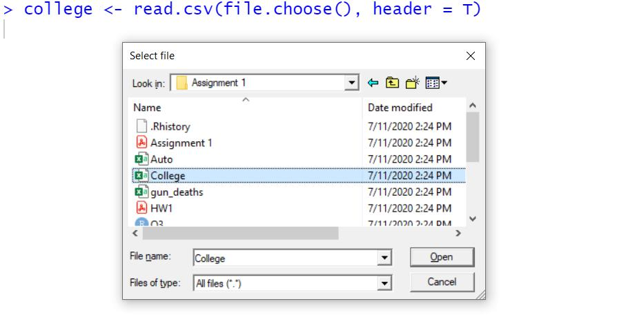
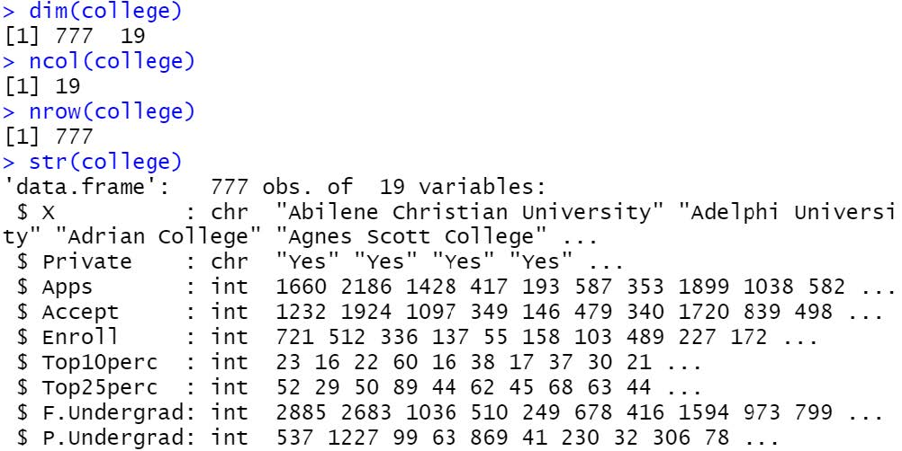
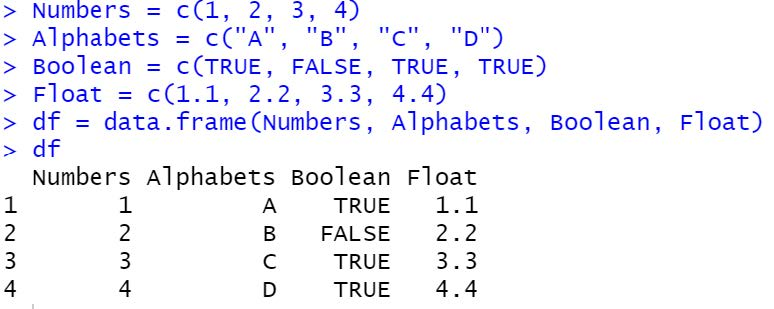
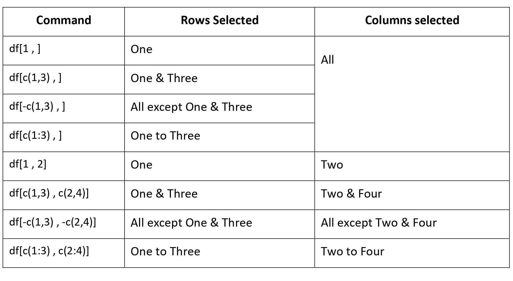
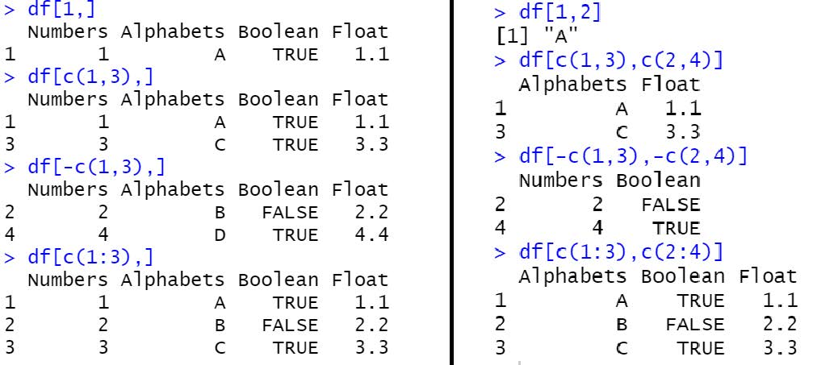
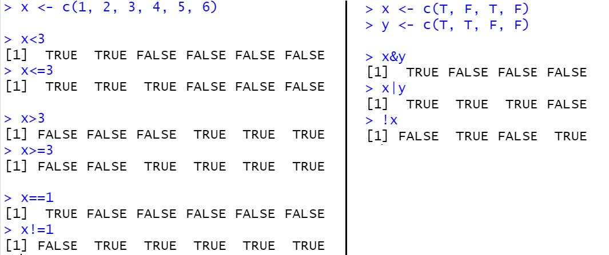

FIXME

### **1. VECTORS**
Vectors are the basic data structure of R. Vectors can hold multiple values together using the concatenate **c()** function. 
The type of data inside a vector can be determined by using **typeof()** function and the length (or)
number of elements in a vector can be found with **length()** function. 

R uses one indexing, hence the position of the first component in a vector can be accessed by,**vector_name[1]**
 ~~~
 > x <- C (9,8,7,6)
 > x
 [1] 9,8,7,6
 > type of (x)
 [1] "double"
 > lenght (x)
 [1] 4
 > x [1]
 [1] 9
  > x [3]
 [1] 7
 
 ~~~
{: .language-r}
 
 

A vector will **always** contain data of same data type. If a vector contains multiple data types 
the vector will convert all its values to the same data type in the below order of precedence: 

• Character 

• Double (Float / Decimals) 

• Integers (Round whole numbers)
~~~
 > x <- c(9,8,7,6.32)
 > x
 [1] 9,8,7,6.32
 > type of (x)
 [1] "double"
 
 > x <- c(9,8, "Hello")
 > x [1]
 [1] "9" "8" "Hello"
 > type of (x) 
 [1] "character"
 
 > x <- c(3:6)
 > x
 [1] 3,4,5,6
 > type of (x)
 [1] "integer"

 ~~~
{: .language-r}
 

#### **Analyzing a Vector**

class(vector_name) - Type of data present inside the vector 

str(vector_name) - Structure of the vector 

is.na(vector_name) - Checks if each element of vector is “NA” 

is.null(vector_name) - Checks if the entire vector is empty 

length(vector_name) - Number of elements present inside the vector

Syntax:

~~~
> x <- c(1,2,3,4)
> class (x)
[1] "numeric"
> str (x)
num [1:4] 1 2 3 4 
> length (x)
[1] 4

~~~
{: .language-r}

####  **Subsetting a vector**

R uses one-indexing mechanism where the elements in the vector start with an index number of one.

vector_name[4] - Element at the fourth position (index) in the vector

vector_name[1:4] - Elements from positions 1 to 4 in the vector

vector_name[c(1,4)] - Elements at positions 1 & 4 only in the vector

vector_name[-c(1,4)] - All elements except those at positions 1 & 4 in the vector

~~~
> x <- c("A", "B", "C", "D", "E")
> x[1]
[1] "A"
> x[4]
[1]"D"

> x[1:4]
[1] "A", "B", "C", "D"

> x[c(1,4)]
[1] "A" "D"

> x[-c(1,4)]
[1] "B", "C", "E"

~~~
{: .language-r}
#### **Sorting a vector**

Sorting of a vector can be performed using two different functions

sort(vector) - Sorts the vector numerically or alphabetically based on vector type 
              (ascending by default)

order(vector) - Returns the indices of the vector in the order they would appear when 
                the vector is sorted (ascending by default)
                

### **2. DATA FRAME** 

Data frames are used for storing Data tables in R. They are two-dimensional array structure and
are similar to tables where each column represents one variable. The main features to note about 
a data frame are: 

• Columns can be of different data types

• Each column name must be unique 

• Each column should be of same length i.e. contain the same number of elements

Data frames in R can be created in two ways: 

• Using data.frame() command 

• Importing data from files such as .csv, .xlsx etc.

**data.frame() FUNCTION:**

While using the command we can follow the below syntax 
    data.frame( column_1, column_2, column_3, …………………….) 
    
Make sure that the names of the columns are unique and are of same length.

Syntax:

~~~
> Numbers = c(1,2,3,4)
> Alphabets = c("A", "B", "C","D")
> Boolean = c( TRUE, FALSE, TRUE, TRUE)
> df = data.frame(Numbers, Alphabets, Boolean)
> class(df)
[1]  "data.frame"

df
Numbers     Alphabets    Boolean
      1             A       TRUE
      2             B      FALSE
      3             C       TRUE
      4             D       TRUE
      
~~~
{: .language-r}

IMPORTING DATA: There are multiple commands with various arguments to import data from different file formats 
into R environment. I shall show the simplest command to import a csv file as a data frame 

data_frame_name <- read.csv(file.choose(), header = T) 

Here, file.choose() - Allows you to choose a .csv file stored in your local desktop, 
header = T - Indicates the first column in the file contains column names

Double click (or) click once and select open on your desired file to import

Once the data has been imported successfully the data frame would be visible with its 
name in the Environment part on the top right

### **Analyzing a data frame:** 

dim(data_frame) - Dimensions of the data frame in the order of (row columns) 

ncol(data_frame) - Number of columns 

nrow(data_frame) - Number of rows 

str(data_frame) - Structure of the data frame 

names(data_frame)    - Names of the columns
colnames(data_frame)

rownames(data_frame) - Names of the rows

head(data_frame, n) - Data present in the first n rows of data frame (n=6 by default) 

tail(data_frame, n) - Data present in the last n rows of data frame (n=6 by default)

### **Subsetting a data frame:**
data_frame[1] - Display only first column 

data_frame[c(1,4)] - Display only column one & four 

data_frame[-c(1,4)] - Display all columns except one & four 

data_frame[c(1:4)] - Display columns one to four

#### **Consider a dataframe created with the below commands:**
Numbers = c(1, 2, 3, 4) 

Alphabets = c("A", "B", "C", "D") 

Boolean = c(TRUE, FALSE, TRUE, TRUE) 

Float = c(1.1, 2.2, 3.3, 4.4) 

df = data.frame(Numbers, Alphabets, Boolean, Float)

df

data_frame_name[rows, columns] – Subset based on rows and columns

### **Help function:** 

help(function_name) – Provides detailed description of function in help window (bottom right)
E.g. Run the command help(sort) in the console

You will now get a complete description of the “sort” function in the help window

Points to note:

• If a function’s argument is not given any value (such as x in the above picture) in the help description, 
this value must be compulsorily specified while running the function 

• If a function’s argument is given a value (decreasing = FALSE in above pic) this value is the default value considered by R. 
It needs to be specified compulsorily when the argument’s value needs to be different

## **LOGICAL OPERATORS:** 

Provides a list of Boolean results based on operation performed 

< - Less than 

<= - Less than or equal to 

>-Greater than 

>=-Greater than or equal to 

== - Equal to 

!= - Not equal to 

x&y - AND operation 

x|y - OR operation

!x - NOT operation

Please note that in R the Boolean values “TRUE” & “FALSE” can also be written as “T” &”F”


