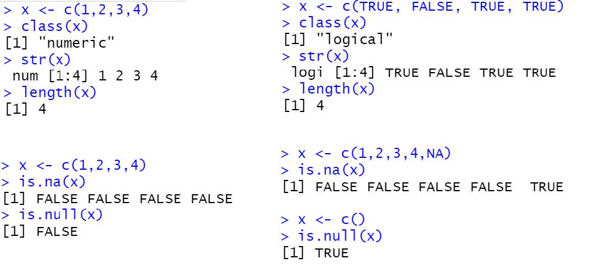

FIXME

## Strings 

- Strings are made of a single character or contain a collection of characters.
-
- Strings can be created by either single quotes (‘ ‘) or double quotes (“ “)

**Rule for String in R**

-	String starts and ends with a single quote. Double quotes (“ “), and through the escape sequence (‘/’), single quote can become a part of the string.
Example- ‘buses’, ‘merry”s’, ‘ merry\’s’

-	String start and end with a double quote. Single quote (‘ ‘), and through the escape sequence (‘\’), double quote can become a part of the string 
Example : “buses”, “merry’s”, “ merry\”s”

~~~
# input code string concatenation 
Count number of characters in string
x1 <- "Olivia"
x2 <- "Jhon"
x3 <- "William"

#checking number of characters
nchar(x1)
nchar(x2)
nchar(x3)

# Letters using vector function in R
# Check the sequence of letters
letters
letters[4]
letters[1:5]

# String Concatenation
# Paste function is used with syntax below:
# paste(..., sep = " ", collapse = NULL)

x <- paste("Hello","World", "!", sep = " ", collapse = "--")
x

y <- paste(x1, x2, x3, "is happy.")
y

z<- paste("Hello","everyone","!", sep =" ")
z

x4 <- c("Olivia", "Jhoin", "William")
y1 <- paste(x4, "is happy.")
y1

y2 <- paste(x4, "is happy.", collapse = " -- ")
y2

z1 <- c("Please bring me", "a few ")
z2 <- c("some vegetables", "fruits")
z <- paste(z1, z2, collapse = " and ")
z
~~~
{: .language-r}

~~~
# output
> x1 <- "Olivia"
> x2 <- "Jhon"
> x3 <- "William"
> 
> #checking number of characters
> nchar(x1)
[1] 6
> nchar(x2)
[1] 4
> nchar(x3)
[1] 7
> # Letters using vector function in R
> # Check the sequence of letters
> letters
 [1] "a" "b" "c" "d" "e" "f" "g" "h" "i" "j" "k" "l" "m" "n" "o" "p" "q" "r" "s" "t" "u" "v" "w" "x"
[25] "y" "z"
> letters[4]
[1] "d"
> letters[1:5]
[1] "a" "b" "c" "d" "e"
> # String Concatenation
> # Paste function is used with syntax below:
> # paste(..., sep = " ", collapse = NULL)
> x <- paste("Hello","World", "!", sep = " ", collapse = "--")
> x
[1] "Hello World !"
> z<- paste("Hello","everyone","!", sep =" ")
> z
[1] "Hello everyone !"
> y <- paste(x1, x2, x3, "is happy.")
> y
[1] "Olivia Jhon William is happy."
> x4 <- c("Olivia", "Jhoin", "William")
> y1 <- paste(x4, "is happy.")
> y1
[1] "Olivia is happy."  "Jhoin is happy."   "William is happy."
> y2 <- paste(x4, "is happy.", collapse = " -- ")
> y2
[1] "Olivia is happy. -- Jhoin is happy. -- William is happy."
> z1 <- c("Please bring me", "a few ")
> z2 <- c("some vegetables", "fruits")
> z <- paste(z1, z2, collapse = " and ")
> z
[1] "Please bring me some vegetables and a few  fruits"
> 
~~~
{: .output}

## Data Structure
### Vector
Vectors are the basic data structure of R. Vectors can hold multiple values together using the concatenate **c()** function. The type of data inside a vector can be determined by using the **type of()** function and the length (or) number of elements in a vector can be found with the **length()** function. 

R uses **one indexing** unlike python, hence the position of the first component in a vector can be accessed by vector name [1]

A vector will always **contain** data of the **same data type**. If a vector contains multiple data types the vector will convert all its values to the same data type in the below order of precedence:
- Character 

- Double (Float / Decimals)

- Integers (Round whole numbers) 

~~~
# input codv1 <- c(1, 2, 3, 4, 5)
v1
is.vector(v1)

v2 <- c("a", "b", "c")
v2
is.vector(v2)

v3 <- c (TRUE, TRUE, FALSE, FALSE, TRUE)
v3
is.vector(v3)

v4<- c (TRUE, TRUE, "a", 5)
v4 
typeof(v4)

v1 <- c(1, 2, 3, 4, 5)
v1
is.vector(v1)

v2 <- c("a", "b", "c")
v2
is.vector(v2)

v3 <- c (TRUE, TRUE, FALSE, FALSE, TRUE)
v3
is.vector(v3)

v4<- c (TRUE, TRUE, "a", 5)
v4 
typeof(v4)

~~~
{: .language-r}

~~~
# output
> v1 <- c(1, 2, 3, 4, 5)
> v1
[1] 1 2 3 4 5
> is.vector(v1)
[1] TRUE
> 
> v2 <- c("a", "b", "c")
> v2
[1] "a" "b" "c"
> is.vector(v2)
[1] TRUE
> 
> v3 <- c (TRUE, TRUE, FALSE, FALSE, TRUE)
> v3
[1]  TRUE  TRUE FALSE FALSE  TRUE
> is.vector(v3)
[1] TRUE
> 
> v4<- c (TRUE, TRUE, "a", 5)
> v4 
[1] "TRUE" "TRUE" "a"    "5"   
> typeof(v4)
[1] "character"
> 

~~~
{: .output}

#### **Analyzing a Vector**

class(vector_name) - Type of data present inside the vector 

str(vector_name) - Structure of the vector 

is.na(vector_name) - Checks if each element of vector is “NA” 

is.null(vector_name) - Checks if the entire vector is empty 

length(vector_name) - Number of elements present inside the vector

####  **Subsetting a vector**

R uses one-indexing mechanism where the elements in the vector start with an index number of one.

vector_name[4] - Element at the fourth position (index) in the vector

vector_name[1:4] - Elements from positions 1 to 4 in the vector

vector_name[c(1,4)] - Elements at positions 1 & 4 only in the vector

vector_name[-c(1,4)] - All elements except those at positions 1 & 4 in the vector

~~~
> x <- c("A", "B", "C", "D", "E")
> x[1]
[1] "A"
> x[4]
[1]"D"

> x[1:4]
[1] "A", "B", "C", "D"

> x[c(1,4)]
[1] "A" "D"

> x[-c(1,4)]
[1] "B", "C", "E"

~~~
{: .language-r}

#### **Sorting a vector**

Sorting of a vector can be performed using two different functions

sort(vector) - Sorts the vector numerically or alphabetically based on vector type 
              (ascending by default)

order(vector) - Returns the indices of the vector in the order they would appear when 
                the vector is sorted (ascending by default)
                

