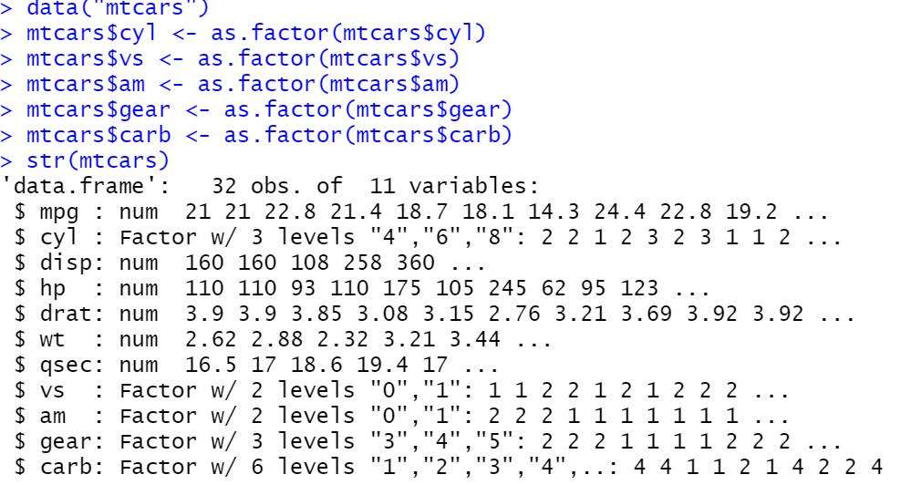

## **UNIVARIATE ANALYSIS**

R has many in-built datasets using which we can use. 

You can find the available list of datasets and its description **here**.

You can also view a detailed description of the data set using the command **help("data_set_name")**

### **1. FACTOR:**

Kindly run the below command to load the in-built dataset mtcars in your R session: 

library(datasets)

data("mtcars")

mtcars$cyl <- as.factor(mtcars$cyl) 

mtcars$vs <- as.factor(mtcars$vs) 

mtcars$am <- as.factor(mtcars$am) 

mtcars$gear <- as.factor(mtcars$gear) 

mtcars$carb <- as.factor(mtcars$carb) 

str(mtcars) 

The as.factor is used to convert a column of different data type to a factor data type

The columns **cyl, vs, am, gear, carb** are all factors with **3, 2, 2, 3, 6** individual values, respectively.

To select an individual column, you can write the code in below format using **$** symbol 

Data_frame_name$column_name 
Eg: **mtcars$cyl**

Below are commands to perform univariate (single variable) analysis in R

[FIXME add command and description image]

[FIXME add code image]

### **2. NUMERIC:**

[FIXME add command and description image]

Quantiles divide the range of values in equal distribution. For e.g. 50% quantile represents 
a value such that 50 percent of the values in the given list are below this value and 50 percent of
the values in the given list are above this value (which is the median)

Quantile 0% - Lowest value in the list
Quantile 50% - Median value in the list 
Quantile 100% - Highest value in the list 

Kindly find a video explaining in detail quantile and percentiles **here**.

[FIXME add code image]

## **BIVARIATE ANALYSIS**

### **1. TWO FACTORS:** 

We will now use the esoph dataset whose description can be found **here**. Load the dataset using: 

   data(esoph)
   
   View(esoph) 
   
   str(esoph)
   
The esoph dataset hast three factor columns: 

**➢ agegp – Age group** 

**➢ alcgp – Alcohol consumption** 

**➢ tobgp – Tobacco consumption**

To compare and analyze two factors the same commands as a univariate factor analysis is used with a slight change in the arguments passed:

[FIXME add command and description image]

[FIXME add code image]

You can use the below two functions to perform operations on table and proportionality tables:

[FIXME add command and description image]

[FIXME add code image]

The **prop.table()** command has an argument “margin” which is used to calculate percentages along individual rows/columns

[FIXME add command and description image]

[FIXME add code image]

### **2. TWO NUMERICS:**

We analyze the relationship between two numeric variables using correlation metric.

Correlation → Helps establish a relationship between the two numerical variables Correlation 
* Has value between -1 to +1 Correlation 

* Value farther from zero, more related are the two numerical variables Correlation

* Value closer to zero, less related are the two numerical variables Correlation

* Positive, indicates a direct relationship. Increase of one value in one variable Correlation 
  causes an increase of value in the other variable and vice-versa Correlation 
  
* Negative, indicates an inverse relationship. Increase of value in one variable Correlation 
  causes a decrease of value in the other variable.
  
  [FIXME add correlation image]
  
  Videos explaining correlation in detail – **Part 1 & Part 2**
  
Correlation is performed in R using the below command
  
**cor(numeric_variable1, numeric_variable2)** - Correlation value between the two numeric variables
  
Import the **mtcars dataset** using the commands data(mtcars) -> View(mtcars)
  
  **mtcars** has a few numerical variables 
  
  ➢ **mpg**- Miles/(US) gallon (or) Mileage 
  
  ➢ **disp** - Displacement 
  
  ➢ **hp** - Horsepower

Now we can run the below commands to determine the correlation relationship

[FIXME add command and description image]

The correlation value is negative between mileage and horsepower. Thus, there is an inverse 
relationship between them i.e. Higher the horsepower, lower is the car mileage and vice versa.

The correlation value is positive between displacement and horsepower. Thus, there is a 
direct relationship between them i.e. Higher the displacement, higher is the car horsepower 
and same for lower values (Lower displacement indicates a lower horsepower).

### **3. ONE FACTOR & ONE NUMERIC:**

Use below commands to analyze one factor and one numeric variable

~~~
aggregate(Numerical_column ~ Factor_column,
dataset_name, Function_to_perform) 

summarise()

describeBy(Numerical_column , Factor_column)  

~~~
{: .language-r}

~~~
aggregate(Numerical_column ~ Factor_column,dataset_name, Function_to_perform)- Perform one specific numerical analytics on each group of the factor column

summarise() - Perform multiple numerical analytics on each group of the factor column

describeBy(Numerical_column , Factor_column)- Perform all numerical analytics on each group of the factor column

~~~
{: .language-r}

[FIXME add code image]

## **PROBABILITY**

### **NORMAL DISTRIBUTION:**

Distribution of the values creates/follows a bell curve. The distribution of the variable follows a 

Gaussian curve 

**μ**- Mean (Average) 

**Variance** -  Sum of square of the difference of each value from mean divided by number of values 

**σ** – Standard Deviation (Square root of variance)

[FIXME add Normal Distribution image]

Not all normal distributions are same. They differ based on the values

[FIXME add Normal Distribution image]

To generate a normal distribution in R we can use the **rnorm()** function 

Syntax:

~~~
rnorm(mean_value, sd_value, number_of_values)
~~~
{: .language-r}

E.g.: rnorm(mean=1000, sd=250, 100) 
The above code will generate a list of 100 random values such that they follow a normal
distribution with mean at 1000 and a standard deviation of 250 

To visualize the distribution of the values try running the below set of commands 
values <- rnorm(mean=1000, sd=250, 10000) 
hist(values, main="Normal Distribution", col="steelblue", xlab="Mean=1000, SD=250", freq=F)
lines(density(values), col="yellow", lwd=3) 

hist – Creates a histogram 
lines – Draws the line describing the distribution

[FIXME add Normal Distribution image]

### **Z-SCORES:**

Number of standard deviations the value is away from mean

[FIXME add formula image]

For a random normal distribution with mean 100 and standard deviation (sd) of 30 
the z-score for a value of 76 and 136 can be calculated as, 
X = 76     X = 136
Z = (76 - 100) / 30     Z = (136 - 100) / 30
  = -0.8 SD from mean     = +1.2 SD from mean
  
### **PERCENTILE:** 

The measure describes the percentage of values that are below the observed value in a distribution. 
Percentiles are different from percentage on the grounds that, percentage represents the value out 
of 100 but percentile indicates the percentage of values that are below the observed value.

For e.g., in a class of 100 students if a student scores 42 marks in a test out of 50, 
Percentage = (42/50) X 100 = 84%

If 42 is the third highest mark it means the student has scored more marks than 97 of his/her classmates,

Percentile = (97/100) X 100 = 97% 

Thus, the student is in the 97th percentile, indicating that 97% of the marks in the class are below 
the score of 42 (or) the student has scored higher than 97% of his/her classmates.

Note: Percentile can never be 100. In the above example if the student was the topper, then 
he/she has scored better than 99 of his/her classmates and is in the 99th percentile.

Given an observed value, mean and sd you can calculate the percentile in R using pnorm() function. 
Kindly note that the result is a value between 0 and 1. To represent the percentile in terms 
of percentage, we will have to multiply it by 100. 

Syntax: 
~~~
pnorm(observed_value, mean, sd) 

~~~
{: .language-r}

E.g.: pnorm(65, 50, 10)

Similarly if you are given the percentile value, mean and sd the value can be calculated using **qnorm()** function. 

Syntax: 
~~~
qnorm(percentile_value, mean, sd) E.g.: qnorm(0.9, 50, 10)
~~~
{: .language-r}

~~~
> pnorm (65, 50, 10)
[1] 0.9331928
> qnorm (0.9, 50, 10)
[1] 62.81552
~~~
{: .language-r}

You can find a video explaining percentiles **here.**


